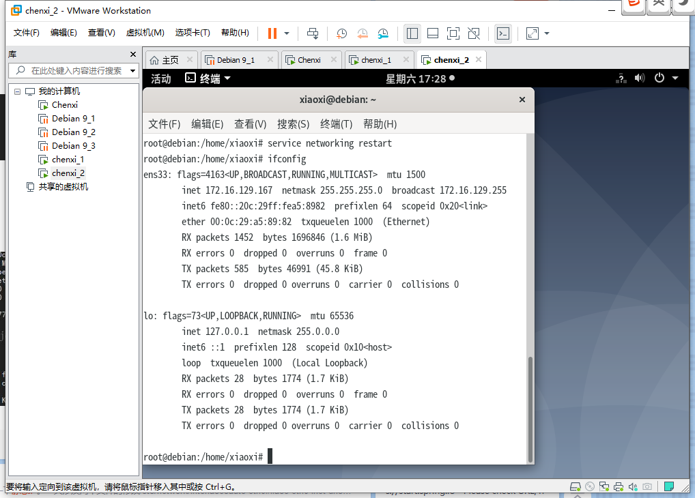
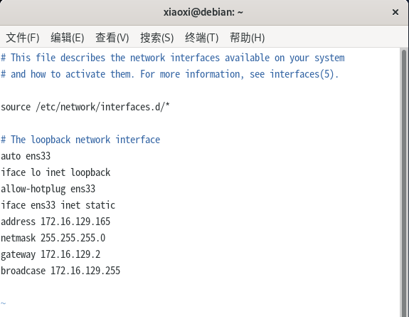
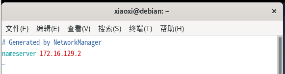
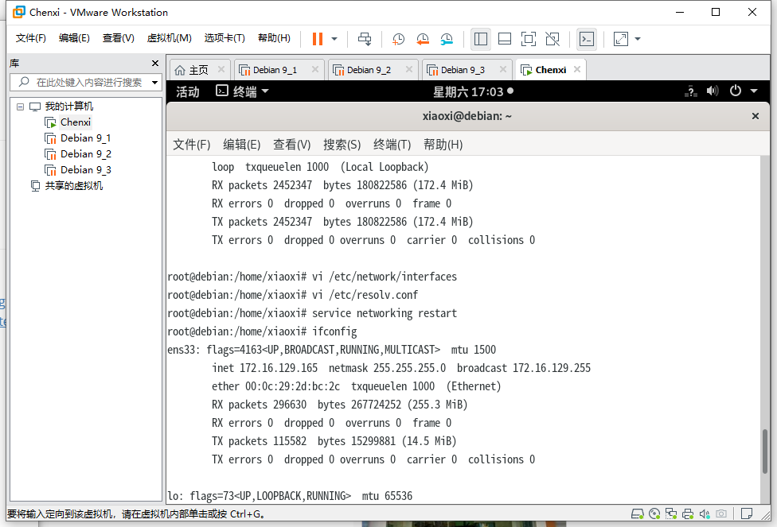
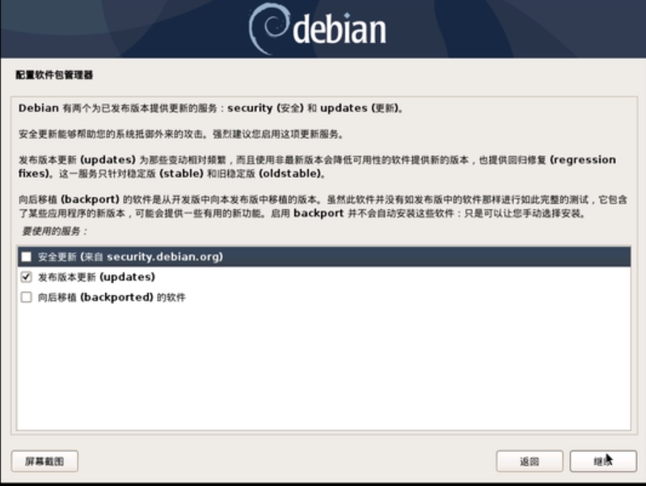
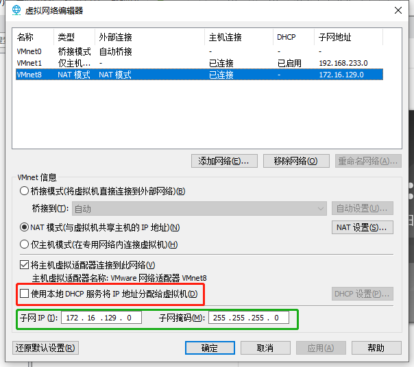

## 要求

本地尝试安装3个Linux虚拟机，IP分别为172.16.129.165/166/167

## 完成截图





## 笔记

例如想要设置网络的信息如下：

```
IP地址：172.16.129.165
子网掩码：255.255.255.0 # netmask
网关：172.16.129.2 # gateway

广播地址：172.16.129.255
DNS：172.16.129.2
```

### 1 取消DHCP

在虚拟机的编辑-虚拟网络编辑器里面，把dhcp服务关掉，并设置子网IP和子网掩码


然后我们需要编辑2个文件

/etc/network/interfaces（配置IP和网关）

/etc/resolv.conf（配置DNS服务器）

### 2 编辑 interfaces 文件

先使用如下编辑interfaces文件：

```
vi /etc/network/interfaces
```

使用如下的命令：

auto eth0 #开机自动连接网络
iface lo inet loopback
allow-hotplug eth0
iface eth0 inet static #static表示使用固定ip，dhcp表述使用动态ip
address 10.10.10.155 #设置ip地址
netmask 255.255.255.0 #设置子网掩码
gateway 10.10.10.2 #设置网关

broadcase 10.10.10.255#设置广播地址（也可以不写）

注意：修改文件时需要去掉注释，修改为如下：

```
auto ens33
iface lo inet loopback
allow-hotplug ens33
iface ens33 inet static
address 172.16.129.165
netmask 255.255.255.0
gateway 172.16.129.2
broadcase 172.16.129.255
```



### 3 编辑 resolv.conf 文件

再编辑/etc/resolv.conf

使用如下的命令：

```
vi /etc/resolv.conf
```

 文件改为：

```
nameserver 172.16.129.2
```

 

service networking restart #重启网络

 然后查看ifconfig查看ip地址，更改成功



## 主要问题

### 问题一：

安装虚拟机速度非常慢，可以手动更改安装虚拟机的配置，将安全更新取消



> [视频：解决Debian10安装源慢的问题,5分钟装好Debian](https://www.bilibili.com/video/BV14E411B7Ww?from=search&seid=11217902862449422218)

### 问题二

在使用虚拟机时要用好快照和克隆，比新建虚拟机要省很多麻烦

###  问题三：

设置静态ip地址之后，使用ifconfig查看ip地址时还是不行

### 解决

在虚拟机的编辑-虚拟网络编辑器里面，把dhcp服务关掉，并设置子网IP和子网掩码



总耗时：一天